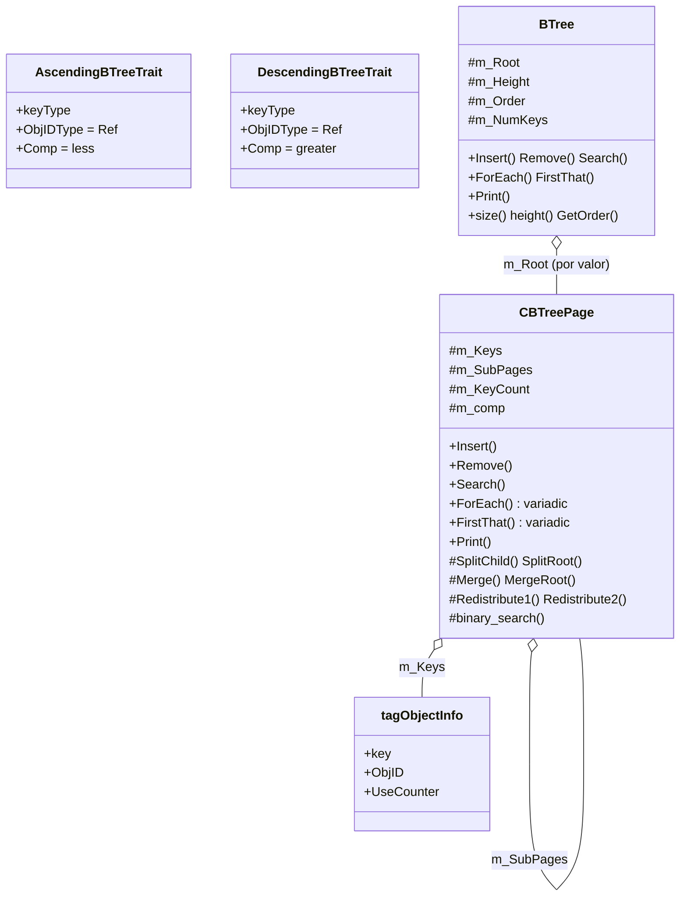
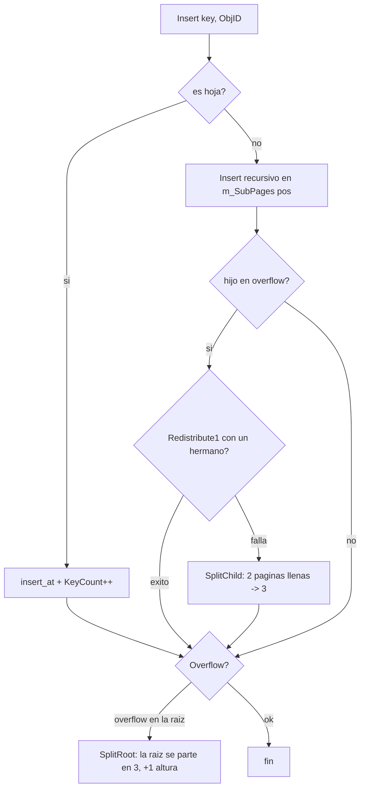
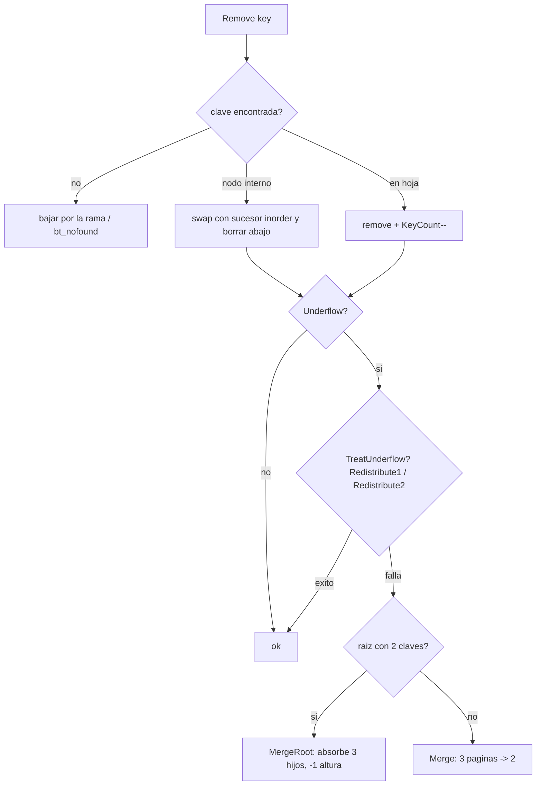

## Descripción

Modernización del `BTree` base del profesor a `BTree<Trait>` / `CBTreePage<Trait>` siguiendo el patrón del repositorio: **Templates + Traits**, comparador del Trait para el orden y recorridos `ForEach` / `FirstThat` **variádicos** (perfect forwarding) en lugar de los punteros a función `void*`. Es la variante **split/merge en 3**: la raíz admite `2*order+1` claves y el resto `order`; el overflow reparte 2 páginas en 3 y el underflow fusiona 3 en 2.

---

## Arquitectura de clases



---

## Flujo de `Insert` — overflow y split en 3



---

## Flujo de `Remove` — underflow y fusión



---

## Archivos modificados / creados

| Archivo | Acción | Descripción |
|---------|--------|-------------|
| `containers/BTreePage.h` | Reescritura | `CBTreePage<Trait>`, comparaciones por `m_comp`, `ForEach`/`FirstThat` variádicos, tipos `size_t`/`Ref` |
| `containers/BTree.h` | Reescritura | `BTree<Trait>`, wrappers variádicos, `order` por constructor |
| `containers/traits.h` | Modificado | `AscendingBTreeTrait` / `DescendingBTreeTrait` (keyType + ObjIDType + Comp) |
| `containers/BTreeDemo.cpp` | Reescritura | Demo: inserción, `Print`, `Search`, `ForEach`/`FirstThat`, `Remove` |
| `Makefile` | Modificado | Agrega `containers/BTreeDemo.cpp` a `SRCS` |
| `main.cpp` | Modificado | Llama a `BTreeDemo()` |

---

## Checklist de tareas

| Tarea | Archivo | Línea |
|-------|---------|-------|
| **Adaptar el Demo** | `containers/BTreeDemo.cpp` | 11 |
| **Traits** (Ascending / Descending con `Comp`) | `containers/traits.h` | 15 / 21 |
| Traits aplicados a `BTree` / `CBTreePage` | `containers/BTree.h` / `containers/BTreePage.h` | 14 / 42 |
| **ForEach variádico** (perfect forwarding) | `containers/BTreePage.h` / `containers/BTree.h` | 117 / 58 |
| **FirstThat variádico** | `containers/BTreePage.h` / `containers/BTree.h` | 127 / 62 |

---

## Decisiones de diseño

- **Trait con comparador**: el orden lo decide `Comp` del Trait. `binary_search`, `Insert`, `Remove` y `Search` comparan vía `m_comp` (helper `SameKey`), así `Ascending` y `Descending` funcionan sin duplicar lógica.
- **`ForEach` / `FirstThat` variádicos**: reemplazan los punteros a función `void*` (`lpfnForEach2/3`) del código base por templates con `forward<Args>(args)...`. `Print` se construye encima de `ForEach` con un lambda.
- **`binary_search` como método**: pasó de función global a método de la página para poder usar `m_comp`.
- **Tipos**: `size_t` para conteos/índices/niveles y `Ref` (vía `Trait::ObjIDType`) para el ObjID — sin `int`/`long` crudos.
- **`order` en runtime**: el grado se pasa al constructor (`BTree bt(3)`), como el código base. Raíz `2*order+1`, resto `order`; la variante requiere `order >= 3`.
- **Correcciones sobre el código base**: guarda contra `null` al borrar una clave inexistente (evita el segfault), liberación de los `KeyCount+1` hijos en `Reset` (evita la fuga del hijo derecho) y reparto parejo en `Merge` (idéntico en orden 3, evita el desborde en otros órdenes).

---

## Cómo ejecutar

```bash
make clean && make
./main
```

---

## Salida del demo

```
=== B-TREE (orden 3) ===
size=62  height=3  order=3

		0->729
		1->1
	2->16
		3->3025
		4->1681
		5->961
	6->1024
		7->1089
		8->64
		9->144
A->169
		B->1156
		C->1369
		D->0
	E->441
		...
m->3600
		...
		z->81

Search('Z') -> 2116
Search('@') -> -1 (no existe)
letras en el arbol: 52
FirstThat('M') -> encontrado, ObjID=3249
tras borrar A,z,5 -> size=59
```
