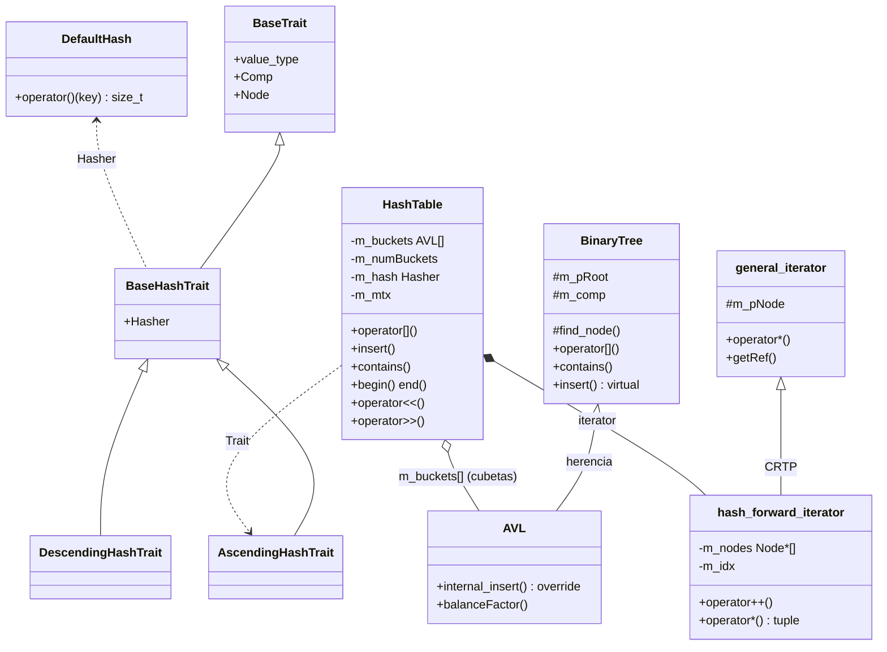
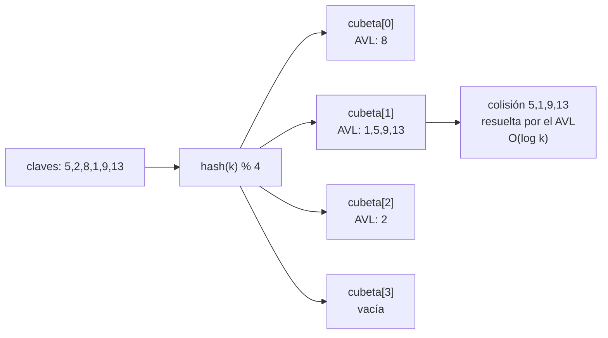
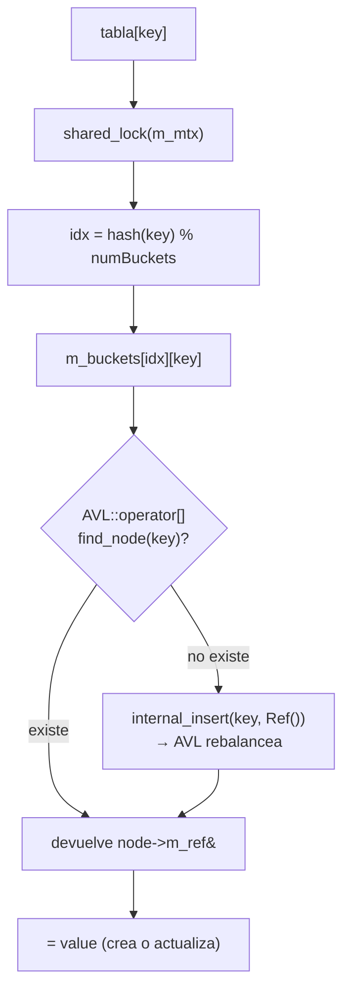
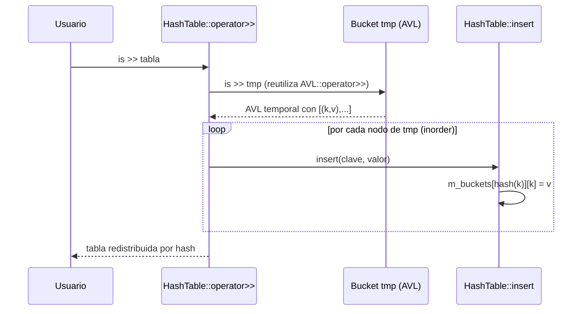

## Descripción

Implementación de `HashTable<Trait>` como **tabla hash real**: un arreglo de cubetas indexado por `hash(clave) % numCubetas`, donde las colisiones se resuelven por **encadenamiento**, pero en vez de una lista enlazada cada cubeta es un `AVL<Trait>` (búsqueda intra-cubeta en `O(log k)`). Se mantiene el patrón **Templates + Traits + CRTP** del repositorio: el hasher se empaqueta en el Trait, el iterador deriva de `general_iterator` y la concurrencia usa `shared_mutex`.

---

## Arquitectura de clases



---

## Reparto por la función hash y encadenamiento



---

## Flujo de `operator[]` (find-or-insert)



> El `shared_lock` protege solo el arreglo de cubetas (que no cambia); el `unique_lock` fino lo toma el AVL de la cubeta, de modo que inserciones en cubetas distintas pueden ocurrir en paralelo.

---

## Flujo de `operator>>` (reutiliza el AVL)



---

## Archivos modificados / creados

| Archivo | Acción | Descripción |
|---------|--------|-------------|
| `containers/hashtable.h` | Reescritura | Tabla hash real: `DefaultHash`, `BaseHashTrait` (empaqueta el Hasher), arreglo de cubetas `AVL<Trait>`, `hash_forward_iterator` (CRTP), Big-Five y persistencia |
| `containers/BinaryTree.h` | Modificado | Se agregan `operator[]` (find-or-insert) y `contains()`, de los que depende cada cubeta para resolver colisiones |
| `containers/HashDemo.cpp` | Modificado | Demo: reparto por hash, contenido por cubeta, recorrido `[clave, valor]`, persistencia y copy/move |
| `Makefile` | Modificado | Agrega `HashDemo.cpp` a `SRCS` y genera dependencias de headers (`-MMD -MP`) |

---

## Checklist de tareas — HashTable

| Tarea | Archivo | Línea |
|-------|---------|-------|
| Constructor copia | `containers/hashtable.h` | 103 |
| Move constructor | `containers/hashtable.h` | 112 |
| `m[5] = 3;` (`operator[]`) | `containers/hashtable.h` | 145 |
| `for (const auto& [key, value] : m)` | `containers/hashtable.h` | 34 |
| `operator<<` (persistencia) | `containers/hashtable.h` | 183 |
| `operator>>` | `containers/hashtable.h` | 198 |
| `operator[]` / `contains` de soporte | `containers/BinaryTree.h` | 347 |

---

## Decisiones de diseño

- **Tabla hash real, no simulada**: en vez de un solo árbol, hay `m_numBuckets` cubetas. El índice es `hash(clave) % numCubetas` y cada cubeta es un `AVL<Trait>` que ordena y balancea las claves que colisionan (búsqueda `O(log k)` en vez de `O(k)` de una lista).
- **El Hasher va en el Trait (patrón Trait/Policy)**: `BaseHashTrait` extiende `BaseTrait` agregando `Hasher`, así `HashTable<Trait>` no necesita un parámetro de plantilla crudo extra. Cambiar la función hash es definir otro Trait.
- **Iterador CRTP que hereda `general_iterator`**: `hash_forward_iterator` toma una instantánea de los nodos de todas las cubetas y la recorre por índice. Su `operator*` devuelve `tuple<value_type, Ref&>`, lo que habilita `for (const auto& [clave, valor] : tabla)`.
- **Lectura reutilizando el AVL**: el formato plano `[(k,v),...]` es el mismo que parsea el `operator>>` heredado de `BinaryTree`; `operator>>` lee en un AVL temporal y redistribuye los nodos por hash. La escritura recorre las cubetas (ningún sub-objeto contiene la tabla completa).
- **Concurrencia de grano fino**: `shared_lock` sobre el arreglo de cubetas + `unique_lock` por cubeta (en el AVL) → inserciones en cubetas distintas en paralelo. `begin()`/`end()` quedan sin lock (como `BinaryTree`); la serialización toma el lock.

---

## Cómo ejecutar

```bash
make clean && make
./main
cat temp.txt   # tabla persistida en disco
```

---

## Salida de la demo

```
--- HashTable (funcion hash + colisiones resueltas con AVL) ---
tabla[5]   = 55
size       = 6, cubetas = 4, carga = 1.5
reparto por la funcion hash:
  hash(5) -> cubeta 1
  hash(2) -> cubeta 2
  hash(8) -> cubeta 0
  hash(1) -> cubeta 1
  hash(9) -> cubeta 1
  hash(13) -> cubeta 1
contenido de cada cubeta (cada una es un AVL):
  cubeta[0] = [(8,80)]
  cubeta[1] = [(13,130),(9,90),(5,55),(1,10)]
  cubeta[2] = [(2,20)]
  cubeta[3] = []
recorrido  : 8=80 13=130 9=90 5=55 1=10 2=20
contains(9)  = 1, contains(7) = 0
serializa  : [(8,80),(13,130),(9,90),(5,55),(1,10),(2,20)]
leida      : [(8,80),(13,130),(9,90),(5,55),(1,10),(2,20)]
original tabla[5] = 55, copia[5] = 999
movida     : [(8,80),(13,130),(9,90),(5,55),(1,10),(2,20)]
```

> En la cubeta 1 colisionan `5,1,9,13`: el AVL las mantiene balanceadas. La copia es independiente del original (deep copy de cada cubeta): al modificar `copia[5]=999` el original sigue en `55`.
